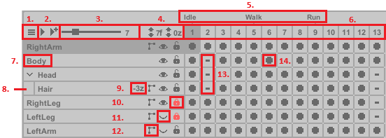

#

The Timeline allows you to create animations by managing **Layers**, **Frames**, and **Cels**. Play the animation in 
real-time to preview changes.

## **Layer**
- An independent visual element in the artwork, allowing isolated modifications without affecting other parts.  
- **Right-click** a layer to create, duplicate, merge, or delete it.
- **Example:** A character's leg might be on its own layer for easier editing.

## **Frame**
- A single step in the animation timeline, displaying all active layers at that point in the sequence. 
  Frames control how artwork changes over time. 
- **Right-click** a frame to create, duplicate, or delete it, or set an **Animation Tag** - which marks the start of a specific animation. **Animation Tags** are not required; they merely organize the timeline into useful segments.  

## **Cel**
- The pixel data of a specific layer within a frame.  
- **Linked Cels:** multiple cels in a row can be linked to share the same data and edits.  
  - **Right-click** a cel to clear, duplicate, or copy it.  
  - **Right-click + drag** to select a single cel or a group of cels: 
  > - Left-click on a frame and drag left or right to reposition the cels.
  > - Clear or duplicate a group of cels. **Deleting cels will also delete their Frames**. 
  > - Link or unlink cels.

 
<b> Note: Creating or deleting layers/frames does not work with undo. </b>

 

## UI Overview

1. **Dropdown Menu** – Choose to display all animations or a specific one.  
2. **Play Buttons** – The first button plays the selected animation; the second plays all animations.  
3. **Global FPS Slider** – Controls the playback speed (frames per second) for all animations.  
4. **Layer-Specific FPS And Depth** – Each layer can have an independent FPS (labeled "f"). The "z" value adjusts the layer’s depth, allowing precise rendering order control.  
5. **Animation Tags** – Right-click a frame to add/remove an animation tag. Tags define animation sequences and are used for naming exports.  
6. **Frame Row** – Only one frame is visible at a time, displaying all layers for that specific point in the sequence.
7. **Layer** – Double-click to rename. Drag to reposition layer order. Layers are rendered top to bottom, meaning the LeftArm layer is on top in the final rendering.  
8. **Child Layer** – A layer nested under another.  
9. **Depth Order** – Displays the current depth value, which can vary per frame.  
10. **Lock Layer** – Prevents any modifications.  
11. **Visibility Toggle** – Hides the layer and prevents modifications (except global move adjustments).  
12. **IK Layer** – Indicates an Inverse Kinematics (IK) layer. Click to toggle the **IK Editor**.  
13. **Empty Cel** – No pixel data.  
14. **Active Cel** – Contains pixel data.  
