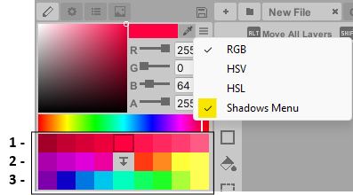
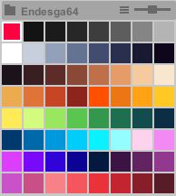
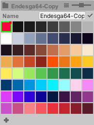

#

## Color Editor

Adjust colors with three modes (uses *Color32*, 8-bit color + alpha).

> - **RGB:** Set red, green, and blue levels (0–255).

> - **HSV:** Pick a hue, then adjust saturation and brightness.

> - **HSL:** Pick a hue, then adjust saturation and lightness.

**Shadows Menu**

This generates three sections of color variations for the selected color.

> - **First row:** creates shadows and highlights

> - **Second row:** generates hue-shifted shadows and highlights

> - **Third row:** produces complementary colors

Press the center button to regenerate colors, and or enable **Reset Shadows On Eyedropper** in **Preferences > General**.

 

## Color Palettes

The color palette stores a set of limited colors, ensuring visual consistency
and quick color swapping while painting. Editing a palette color updates it globally across your 
artwork (requires the **Paint Bucket** tool). **Modifying a palette color is not supported by the 
undo system.**

<b> Note: Only custom palettes can be edited. To modify a preset palette, create a copy first.</b>

 

**Pixelverse** includes predefined color palettes for quick selection. These preset palettes cannot be modified 
- you cannot add or change colors. However, you can still reorganize them by sorting colors based on 
saturation, brightness, etc. If you do sort the preset palettes, you can always restore the original 
palette order in the drop down menu.

**In the drop down menu, to enable editing capabilities:**

1. Create a new empty palette, or

2. Make a copy of an existing preset palette

3. Select edit 

While in edit mode, you can add or delete colors, rename the palette, or import colors from current 
layers using the new dropdown menu option. Remember to exit edit mode when not in use since the **Paint Bucket** 
tool can accidentally modify colors while active. 

**Tip:**

The slider adjusts the color palette's display size.

  

---