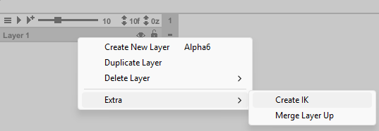
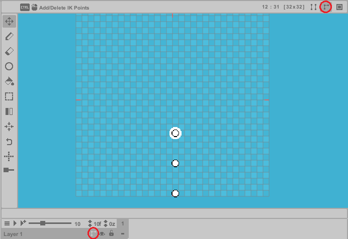
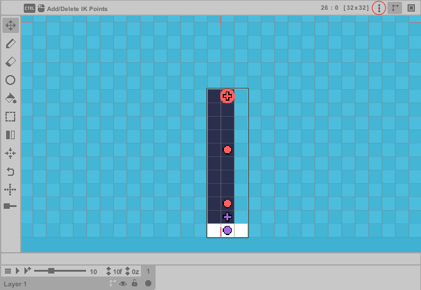
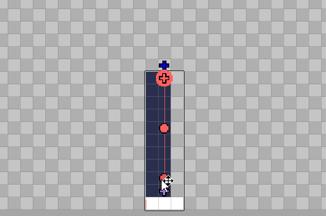

#

The **IK Layer** introduces **Inverse Kinematics** (IK) to pixel art—an experimental tool designed 
to streamline posing and animation. While pixel art inherently struggles with smooth rotations, 
this feature can still be useful for:

> - **Limb positioning:** arms, legs, tentacles, etc.

> - **Higher-resolution:** elements with enough pixels where subtle bends are needed.

The IK system dynamically adjusts pixels in real time, letting you experiment with poses and 
shapes faster, speeding up pixel art creation. While this feature isn’t ideal for every scenario 
(due to pixel art’s rigid nature), it can be useful in some cases.

---
**Getting Started**

To enable **Inverse Kinematics**:

> 1. **Right-click** the desired layer.
> 2. Navigate to **Extra > Create IK**.

To remove IK from a layer, follow the same steps.

When activated, an **IK** icon appears on the layer and in the infobar. Click either icon to 
enter the **IK Editor** (indicated by a blue screen overlay).

While in the **IK Editor**, you must define the **IK HardCopy** - the pixel template that will deform during 
posing. This works similarly to rigging bones in a mesh, establishing the base texture for all IK transformations.

If setup correctly, you'll see a nearly identical preview of this image. The system displays three white points 
by default, representing IK joints (**a minimum of two are required**).

**While in the Move Tool**, hold **Ctrl** and click to add or remove joints (these can only be placed between 
the first and last joint). During editing, joints can be dragged vertically (y-axis) but are locked horizontally (x-axis). 
Once your joints are positioned, you can paint pixels onto the canvas normally like with any other layer.

<b> IK joints can be repositioned at any time. </b>

 

---

During the IK creation process, joints must be initialized to a specific mode. **White** joints are uninitialized and require setup. **Red** joints indicate **IK Mode** (standard inverse kinematics behavior). **Purple** joints indicate **Pair Mode**, which always consists of exactly two joints that operate differently, allowing independent movement, rotation, and stretching within the IK system. 

Both **IK Mode** and **Pair Mode** can be used together in the same system. The essential rule is that each mode must contain at least two joints. While **IK Mode** can have more than two joints, **Pair Mode** must always maintain exactly two joints. *Neither mode can function with just a single joint.*

Every parent joint (depicted by the cross handle) must always have a child joint (depicted by the circle handle). Parent and child joints must have the same color.

 
<b> Important: Users must properly configure the mode for each joint.</b>

 

<b> The "T" key is reserved in the IK Editor to quickly toggle joint modes.</b>

 

To change mode, click on a joint and toggle the **Mode** button next to the main **IK** button in the infobar. Once your 
template is complete, toggle the **IK** button again to exit the **IK Editor**. Be aware: You’ll often need to immediately 
reconfigure the joints in the frame after exiting, as the frame’s IK system requires manual adjustment and operates 
separately from the **IK HardCopy**.

The setup process is almost complete now!

The cross handle is used for moving the entire IK segment, while the round handle moves joints independently. Now you can experiment with IK formations to find which angles work best for your pixel poses. You might use only **Pair Mode** joints or a single **IK Mode** system - many configurations will be unique. Regardless of setup, all poses now maintain their formations across frames. The final critical component is the IK system's rotation algorithm, of which there are three types:

> - **(1) Standard Rotation**: Ideal for high-resolution art but often distorts small pixel art.

> - **(2) Line Algorithm**: Can be more precise for small-scale pixel movement. Sacrifices smooth rotation and performs poorly at higher resolutions. 

> - **(3) Segmented Pixel Movement**: Processes pixels in pairs, resisting local rotation while maintaining pixel integrity.

Each joint can use a different algorithm - you'll likely combine all three in practice. For symmetric elements (like arms), use the local pixel mirroring feature (**X**) to mirror pixels across their joints when necessary.

Adjust these settings via the control buttons near the main **IK** button.

 
<b> Any modification to an IK joint triggers a complete cel reset - all pixels are erased in the cel before the system recreates the pose. Be aware: Any manual pixel edits on this layer will be lost whenever you adjust the IK pose.</b>

 

