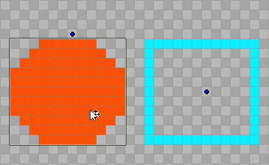
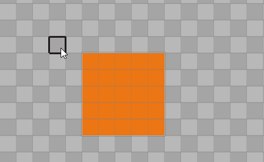
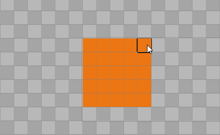
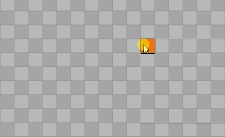
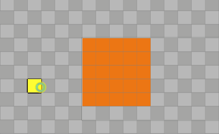
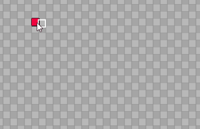
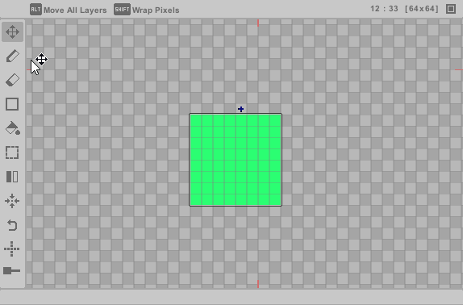

#

## Select, Move

To modify your pixel content, first select a layer by left-clicking inside its content boundary. Once selected, 
you can drag anywhere to reposition the layer content. The drag operation will also apply to any child 
layers of the parent layer.

<b> This action is hardcoded to the right-click, making it convenient, especially when using the Pencil tool.</b>

 
**Tips**

- Hold **Shift** while dragging to move all layers at once for bulk adjustments.
- Hold **Alt** while dragging to wrap pixels that cross over the canvas boundary.

**Quick Move**

Use screen handles (**blue cross**) to move layers efficiently without switching from the 
current layer. When a layer is selected, it is highlighted in **yellow** for clarity. **Quick Move** remains 
available in **Pencil** mode, and it can be enabled in **Preferences > General**.

  

---

## Pencil

The primary tool for painting pixels directly onto the current layer. Use left-click to paint, with
three brush modes: **Circle**, **Rectangle**, and **Line**. Brush thickness is adjustable 
from **1 to 32 pixels**. When active, the **Tool Infobar** displays brush selection and size controls.

This tool also includes several efficiency-focused features that make quick edits smoother, reducing 
the need for frequent tool switching.

**Move A Group Of Pixels**

1. Hold **Shift** + left-click and **drag** to select an area. 
2. Release mouse to confirm selection.
3. Left-click elsewhere to reposition the pixels.

**Move Single Pixel**

1. Hold **Shift** + left-click on a single pixel.
2. Left-click elsewhere to reposition the pixel.

**Contour**

1. Hold **Ctrl** while drawing your shape.
2. Release mouse to automatically fill the interior.

**Mask**

1. Hold **Alt** while painting to only affect areas with existing pixels.

**Shortcuts Workflow**

The **Pencil** is designed to minimize tool switching through shortcuts. Please visit 
the **Shortcuts** section to view the key mappings.

- **Quick Delete:** shortcut to instantly erase a pixel.
- **Eyedropper:** shortcut to quickly sample any color from the canvas.
- **Frame Navigation:** shortcuts to switch between previous and next frames.
- **Layer Movement:** right-click to select and move layers. 

  

---
## Erase
Left-click to remove pixels from the current layer. Current brush thickness is applied. 

  

---
## Shapes

Create standard shapes including **Lines**, **Rectangles**, and **Circles** in various sizes.
Left-click and **drag** to generate a new shape. Current brush thickness is applied.

**Tip:**

- Hold **Shift** while dragging to produce outline-only shapes.
- Hold **Alt** while dragging to wrap pixels that cross over the canvas boundary.

  

---
## Paint Bucket

Fills enclosed areas on the current layer with your selected color.

**Tips**

- Hold **Shift** to replace a color across all layer.
- Hold **Control** to replace a color across all layers.
- Hold **Alt** to replace a color across all frames.
- When editing a color palette, using **Paint Bucket** on a palette color updates all instances of that color across the entire file (all layers and frames).

 
<b> Note: preset color palettes cannot be modified. </b>

  
## Marquee Select
---

Select and transform pixel areas using **move**, **stretch**, **rotate**, or **delete** actions on the current layer. 
Press the shortcut key to cycle through all selection modes.

**Rectangle**  

1. Drag to select a rectangular area. Or double-click to quick select the entire layer. 
2. Release mouse to complete. 

**Circle**  

1. Drag to select a circular area. 
2. Release mouse to complete.  

**Lasso** 

1. Freely draw around pixels to select. 
2. Release mouse to complete.  

**Polygon** 

1. Click to place vertices.  
2. Close the shape to complete.  

**Magic Wand**  

1. Hold **Shift** to select all connected pixels of the same color.
2. Select indefinitely.
3. Release **Shift** to complete.

**When Selection Is Complete** 

1. Transform selection (**move**, **stretch**, **rotate**).  
2.  **Ctrl+V** to paste if necessary.
3. Finalize:  
>  - Left-click outside selection area to apply.  
>  - Press **Delete** to remove.  

1. Or right-click selection to open context menu.  
2. Finalize:  
>  - Send selected area to new **Layer**.
>  - Send selected area to new **Pixelfile** ("New File Cropped").

**Transform Controls**

- **Move:** left-click + drag inside the selection.
- **Stretch:** drag edge handles.
- **Rotate:** rotate green handle (circles around pivot).
- **Pivot:** left-click + drag to reposition.

 
<b> Note: Transform controls does not work with undo. </b>

 

**Tip:** 

Selected pixels can be rotated and flipped mid-transform using the **Rotate** and **Flip** tools.

  

---
## Flip
Flip pixels in the current layer within the content boundary. This will affect child layers.

- **Horizontal Flip:** mirror across vertical boundary axis.
- **Vertical Flip:** mirror across horizontal boundary axis.
- **Canvas Flip:** mirror all layers across canvas y-axis.

<b> Flip operations also affect IK hard-copies. </b>

  

---
## Center Pixels
Instantly center layer contents within the canvas center. This will affect child layers.

- **Full Center:** align to both horizontal and vertical axes (default).
- **Axis-Specific:** center only horizontally or vertically.

  

---
## Rotate

Rotate the layer by 90 degrees counter-clockwise. This will affect child layers.

  

---
## Symmetry

Mirror painting in real-time.  

- **Horizontal:** left/right mirroring.  
- **Vertical:** up/down mirroring. 
- **Diagonal:** x/y cross mirroring.  

**Tip:**

For horizontal/vertical axes, drag on-screen handles to offset center points.

  

---
## Onion

Preview adjacent animation frames as semi-transparent overlays.

- Drag the **onion slider** to adjust opacity (lowest value disables skins).
- **While hovering** the slider:
>   - Toggle next/previous onion visibility  
>   - Enable red/blue tinting for skins