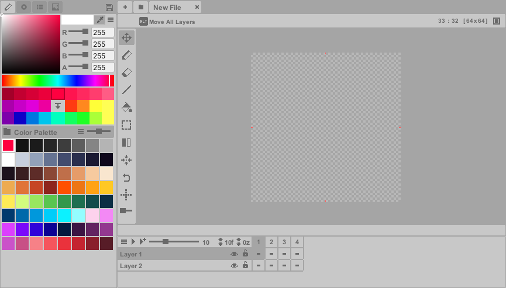
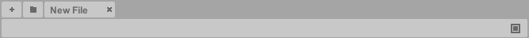

# 

## Welcome 

Pixelverse is a pixel art editor built specifically for Unity, designed to simplify pixel art creation and streamline Unity workflows. It combines standard pixel art tools with experimental features like Inverse Kinematics to accelerate sprite creation. The editor supports animation through the Timeline, along with importing/exporting sprite sheets, GIFs, and individual frames. Keyboard shortcuts are available for efficient editing.

Heads up: Pixelverse is still under active development. While the current version includes all core tools, we're steadily expanding its capabilities. Watch for new features in upcoming releases!

  

---
## Considerations

**Performance**

This editor is optimized for pixel art workflows (**128x128** or lower resolutions). While it supports higher resolutions, using very large canvas sizes may cause performance slowdowns in Unity, depending on your system specifications.

**Undo Functionality**

The undo functionality currently covers basic operations but does not include actions involving:

> - Layer or Frame creation/deletion

> - Layer merging

> - Transform controls

> - Palette color instance modifications

For the time being, there is also no **Redo** functionality.

  

---
## Saving

Unlike other pixel art editors, **Pixelverse** operates within Unity, making pixel art saving a priority due to 
Unity's data serialization. To prevent data loss, **Pixelverse** automatically saves your work frequently.

**Key Triggers for Auto-Save:**

> - Entering **Play Mode**
> - Unity out of focus
> - Compiling a script
> - Timed intervals
> - Exiting Unity

**Best Practices:**

> - To experiment safely, **always create a copy** of your file
> - Use **undo actions promptly** if you make unwanted changes

For manual saves, click the save icon in the upper-left menu. You may experience occasional slowdowns during 
saving.

 

---
## Getting Started

In Unity go to **Window > Pixelverse** to open the editor window.

**Create new file:**  

> 1. Click the **Add** button (+) in the top menu bar. 
> 2. If no files exists, a prompt will appear to create one.  

**Width** and **Height** are in pixels. New **Pixelverse** documents are called **Pixelfiles** – 
which are scriptable objects stored in **Pixelverse/Files**. These files contain all the pixel data along with 
layer and frame metadata. Note that **Pixelfiles** are different from your exported pixel images, 
which can be saved/exported into any folder within Unity (see the **Export** editor).

<b> To delete a Pixelfile, go into the Files folder and right-click to delete it manually.</b>

 

**Open existing file:**  

> - Click the **Folder** button to browse and select files.  

