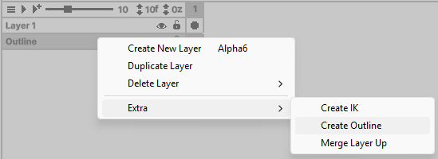
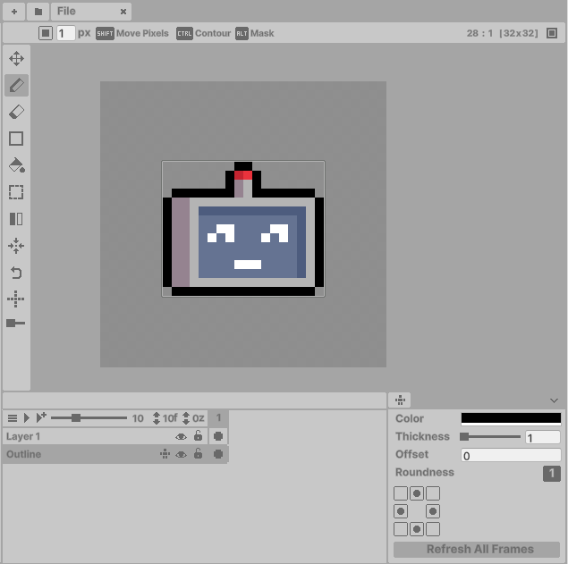

# 

Generates borders for all layers in the current frame. Each layer can disable outlines via the 
Extra Menu. Warning: Like IK Layers, all pixels on this layer will be reset when updated.

**How to enable:**

1. **Right-click** the desired layer
2. Select **Extra > Create Outline**

- To remove, follow the same steps.

**Modifying Outlines**

Access outline controls through the **Extra Menu** (located on the far right of the Timeline window):

Adjust these settings or click **Refresh All Frames** to update:

| Setting       | Description |
|--------------|-------------|
| **Color**    | Outline color |
| **Thickness**| Outline width in pixels |
| **Offset**   | Positions outline inside pixels |
| **Roundness**| Controls corner sharpness |

- Select which sides (N/S/E/W) get outlines

**Tips**

- Outline layers are still controlled by the hierarchy order - rearrange to control layer overlap.
