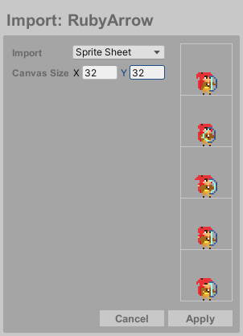

#

## Export

When your artwork is ready, export it as a **Spritesheet**, **Texture List**, **Single Frame**, or **GIF**. 
By default, only visible layers are exported, and the system automatically names files using animation labels or the file name.
**Single Frame** exports will be named individually. Press **Export** to create the export file.

|                 |                                                             |
| :---------------| :-----------------------------------------------------------|
| **Scale**       | Upscales the exported canvas size                           |
| **Save Folder** | Set a custom export folder for the file                     |
| **Export As**   | Output format: spritesheet, textures, single frame, or GIF |

<b> 
Note: The Include option in some export modes lets you choose between exporting all frames or just an individual animation (if one exists).
And if no save folder is set, you will be prompted to select where to export.</b>

 

## Import

You can import **PNG** or **GIF** files by dragging them into the canvas area. *If necessary, the canvas will automatically 
resize and create a new layer for the imported content.*

- **Single Image (≤ canvas size):**  
>  Automatically imports into current frame
- **Single Image (> canvas size):**  
> Prompts to import as:
 >> - Single image
>> - Spritesheet (requires frame size specification)

- **Multiple Images/GIFs:**  
>  Always creates new layer and frames for imported content

